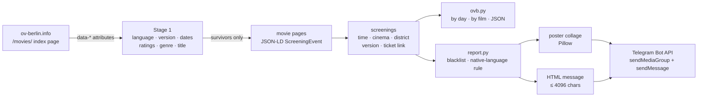

# ovd-berlin


**Original-language cinema in Berlin, filtered the way you actually ask for it.**
Berlin shows hundreds of films a week in their original audio, and
[ov-berlin.info](https://ov-berlin.info) lists them all — but it has no way to ask
*"Japanese films with English subtitles, next week, not at the multiplex"*.
These two scripts do.

For anyone in Berlin who follows films in a particular language and wants the
week's programme either in the terminal or pushed to a Telegram chat as a poster
collage plus a compact listing.

## What it does

- **`ovb.py`** — a terminal CLI. Filter screenings by spoken language, subtitle
  version, date window, cinema, genre, title and IMDb / Letterboxd score; print
  them by day or by film, or dump JSON. Standard library only.
- **`report.py`** — the same data as a Telegram post: an album of poster sheets,
  numbered to match a single HTML message that names every film exactly once.
  Films that were not in the previous post get a red badge. Needs Pillow.

Both read the site directly (no API, no RSS — see [How it works](#how-it-works)),
cache every page for six hours, and never fetch a movie page they have already
filtered out.

<br clear="all">

## Example output

```console
$ ./ovb.py --lang japanese --days 7
Japanese · English subtitles · 10 Sep – 16 Sep 2026 · 7 movies, 20 screenings

Thu 10 Sep
  20:00  Paprika (2006)
         Babylon Alexanderplatz, Mitte  imdb 7.7  lb 4.1  rt 87%
  21:00  Exit 8 (2025)
         Rollberg Kinos, Neukölln  imdb 6.5  lb 3.1  rt 91%

Fri 11 Sep
  17:30  Akira (1988)
         Babylon Alexanderplatz, Mitte  imdb 8.0  lb 4.3  rt 91%
  20:00  Der Himmel über Berlin (1987)
         Babylon Alexanderplatz, Mitte  imdb 7.9  lb 4.3  rt 95%
  22:00  A Page of Madness (1926)
         Babylon Alexanderplatz, Mitte  imdb 7.3  lb 3.8  rt 0%
  ...
```

The Telegram message that accompanies the collage (rendered; the script emits
Telegram HTML):

```text
🇯🇵 Japanese in Berlin cinemas
11 films · 27 screenings · 11 Sep – 22 Sep

𝟭 · Exit 8
▸ Rollberg Kinos, Neukölln
▸ Sputnik-Kino, Neukölln
▸ UCI Kinowelt Berlin East Side Gallery, Friedrichshain

Babylon Alexanderplatz, Mitte
𝟮 · A Page of Madness
𝟯 · Akira
𝟰 · Ghost in the Shell
𝟱 · Nana
𝟲 · Paprika

Delphi Lux, Charlottenburg
𝟳 · Kusama: Infinity

Intimes, Friedrichshain
𝟴 · (New) Detective Conan Film 29: The Fallen Angel of the Highway
𝟵 · (New) Perfect Blue
𝟭𝟬 · Spirited Away
...
```

## How it works



The site publishes RSS feeds, but they carry no language or subtitle information —
only title, link and blurb. So the scripts read two other things:

1. **The `/movies/` index page.** Each movie card carries `data-languages`,
   `data-versions`, per-day `data-day-id` rows with a cinema count, and the IMDb,
   Letterboxd and Rotten Tomatoes scores as data attributes. That is enough to run
   every cheap filter — language, subtitle version, date window, ratings, genre,
   title — in a single request.
2. **The JSON-LD on each surviving movie page.** Its `ScreeningEvent` blocks give
   the exact showtime, cinema, district, subtitle version and ticket link. Only
   movies that passed stage 1 are fetched, six at a time.

Responses are cached in `.cache/` (keyed by URL hash) for six hours; a fetch is
tried up to three times and then falls back to a stale cached copy if one
exists. `--refresh` bypasses the cache, `--ttl` changes its lifetime.

Subtitle versions follow the site's own vocabulary:

| `--subs`           | meaning                                     | aliases                 |
| ------------------ | ------------------------------------------- | ----------------------- |
| `omeu` *(default)* | original audio, English subtitles           | `en`, `eng`, `english`  |
| `omu`              | original audio, German subtitles            | `de`, `ger`, `german`   |
| `ov`               | original audio, no subtitles                | `none`                  |
| `any`              | everything; the version is printed per show | `all`                   |

## Quick start

```sh
git clone https://github.com/constkolesnyak/ovd-berlin.git
cd ovd-berlin

./ovb.py --lang japanese              # Japanese audio, English subtitles, ~2 weeks
./ovb.py --list langs                 # which languages are on right now

pip install -r requirements.txt       # Pillow, for the collage
./report.py                           # dry run: prints the message, writes collage
cp .env.example .env && chmod 600 .env  # then fill in the bot token and chat id
./report.py --send                    # post it
```

Requires Python 3.10+ on macOS or Linux. `ovb.py` has no dependencies beyond the
standard library; `report.py` needs Pillow ≥ 10.1.

More `ovb.py` queries:

```sh
./ovb.py -l korean -s any                     # any subtitle version
./ovb.py -l japanese --group movie --sort rating --links
./ovb.py --min-imdb 8 --genre horror          # any language, English subs
./ovb.py -c babylon -c rollberg               # only these cinemas (substring)
./ovb.py --from 2026-10-01 --to 2026-10-07
./ovb.py -l japanese --json | jq -r '.[].cinema' | sort | uniq -c
```

The exit code is `1` when nothing matches, so it composes in shell pipelines.

## Configuration

Only `report.py --send` needs credentials. They are read from the environment, or
from a `.env` file next to the script (gitignored; real environment variables win).

| Variable             | Meaning                                                          |
| -------------------- | ---------------------------------------------------------------- |
| `TELEGRAM_BOT_TOKEN` | Bot token from [@BotFather](https://t.me/BotFather), `123456:AA…` |
| `TELEGRAM_CHAT_ID`   | Chat or user id to post to, e.g. `123456789`                     |

Find the chat id by messaging the bot once, then opening
`https://api.telegram.org/bot<TOKEN>/getUpdates`.

**`cinema-blacklist.txt`** lists venues to leave out of the report, one name per
line, matched case-insensitively against the full name (`./ovb.py --list cinemas`
prints every name the site uses; `#` starts a comment). Their screenings are
dropped before anything else, so a film that plays *only* there disappears from
the listing and the collage together. Each run reports on stderr how many
screenings were dropped, and names any entry that matched nothing — which is how
you catch a typo. `--no-blacklist` bypasses the file.

**`run-history.json`** is written after every successful `--send`: the film ids
of past posts, kept for 120 days. It is what decides which films get the red
*New* badge (see below). Dry runs and failed sends never touch it.

## CLI reference

### `ovb.py`

| Option                       | Meaning                                                   |
| ---------------------------- | --------------------------------------------------------- |
| `-l`, `--lang NAME`          | spoken language; repeatable or comma-separated, substring |
| `--not-lang NAME`            | drop movies that list this language                       |
| `-s`, `--subs KIND`          | `omeu` (default), `omu`, `ov`, `any`, or an alias         |
| `-d`, `--days N`             | window length from `--from`; default: all the site has    |
| `--from YYYY-MM-DD`          | first day, default today                                  |
| `--to YYYY-MM-DD`            | last day, overrides `--days`                              |
| `-g`, `--genre NAME`         | genre, substring, repeatable                              |
| `-c`, `--cinema NAME`        | cinema or district, substring, repeatable                 |
| `-t`, `--title TEXT`         | title, substring, repeatable                              |
| `--min-imdb X`, `--min-lb X` | minimum IMDb / Letterboxd score                           |
| `--group day\|movie`         | listing layout (default `day`)                            |
| `--sort date\|rating\|title` | film order for `--group movie` (default `date`)           |
| `--links`                    | print ticket links                                        |
| `--json`                     | dump the matching screenings as JSON                      |
| `--list langs\|cinemas\|genres` | print the available values and exit                    |
| `-r`, `--refresh`            | bypass the cache                                          |
| `--ttl SEC`                  | cache lifetime (default 21600)                            |
| `--no-color`                 | plain output even on a terminal                           |

`--lang` matches any language *listed* for a movie, so a multi-language film shows
up under each of them. `--not-lang german` or `--title` narrow that down.

How far ahead the data goes is the site's limit: ov-berlin.info publishes about
15 days, and only the first nine or so are dense, because Berlin cinemas announce
their programme one Thursday-to-Wednesday week at a time.

### `report.py`

| Option                | Meaning                                                          |
| --------------------- | ---------------------------------------------------------------- |
| `--send`              | post to Telegram; without it, print the message and write the PNG |
| `--lang LANG`         | spoken language, exact site spelling (default `Japanese`)        |
| `--from YYYY-MM-DD`   | first day, default tomorrow                                      |
| `--to YYYY-MM-DD`     | last day, default open-ended                                     |
| `--loose`             | keep films that merely list the language (see below)             |
| `--no-blacklist`      | ignore `cinema-blacklist.txt`                                    |
| `--collage PATH`      | where to write the sheet(s) (default `collage.png` beside the script) |
| `--chunk N`           | films per sheet (default 6); `0` puts everything on one sheet    |
| `--separate`          | send the sheets as individual photos instead of one album        |
| `-r`, `--refresh`     | bypass the cache                                                 |
| `--ttl SEC`           | cache lifetime                                                   |

```sh
./report.py --lang Korean --from 2026-10-01 --to 2026-10-14
./report.py --chunk 0 --separate
```

**`--lang Japanese` means Japanese cinema, not "has Japanese in it".** A film
qualifies if the language *leads* its language list or its country of origin
matches (Japan; South Korea / Korea; China / Taiwan / Hong Kong). Both rules are
needed: *Wings of Desire* and *Marty Supreme* merely contain Japanese dialogue,
while *The Wind Rises* is Ghibli but lists Japanese last. Skipped films are
reported on stderr; `--loose` keeps them.

### Design notes on the post

- **One album, then one message.** All sheets go out as a single media group
  (`sendMediaGroup`, ten per group) and the listing follows as its own message.
  It cannot ride along as the album's caption: captions are capped at 1024
  characters and the listing runs past that.
- **Every film is named exactly once.** Films playing at several venues come
  first, each heading its own block of cinemas (`▸ Venue, District`); everything
  else plays at a single cinema and is grouped under it. No year, rating or
  showtimes — tap the title for those. Numbers are mathematical bold digits, so
  they stand out inside headings that are already bold.
- **Poster *n* is line *n*.** The message is rendered first, and the collage
  follows its display order; each poster carries a numbered badge.
- **Six posters per sheet** (`--chunk`). Splitting buys resolution: one sheet of
  everything hits the 2560 px ceiling past which Telegram re-encodes, while six
  per sheet lets each poster render at the 500 px the site serves. Every sheet
  keeps the same canvas so the album stays uniform; a short last sheet is
  centred on both axes.
- **Nothing is cropped.** Posters share a width but vary in height, so the cell
  takes the median aspect ratio and each poster is scaled to *fit*. Sheets are
  portrait (target aspect 0.70) because that is what a phone screen wants, even
  though Telegram's album mosaic tiles portrait images less tidily.
- **The backdrop is the posters' own colours**, bled outwards and blurred, then
  screened onto near-black, so the empty part of a short sheet reads as design
  rather than as a missing tile. Posters sit on a soft drop shadow.
- **New films are marked.** A film absent from the last delivered post gets a
  red disc on the sheet and an italic *(New)* in the message. The baseline is
  the newest run at least three days old, so a retry or a duplicated run
  compares against the same previous week instead of blanking its own badges.
- **It degrades before it breaks.** Telegram measures the 4096-character limit
  in UTF-16 units; if the listing exceeds it, districts go first, then whole
  films from the tail of the display order, with a `+N more` link — never a
  slice through a tag, which Telegram would reject.
- **Festivals & events.** The links from the site's `/events` page close the
  message, so a festival week is visible from the same post.

## Project layout

```text
ovb.py                 scraper + terminal CLI (standard library only)
report.py              Telegram digest: collage, message, delivery; imports ovb
cinema-blacklist.txt   venues left out of the report, one per line
.env.example           TELEGRAM_BOT_TOKEN / TELEGRAM_CHAT_ID template
requirements.txt       Pillow, for report.py
ruff.toml              lint settings
docs/                  the README image

.cache/                fetched pages and posters      (created at run time)
run-history.json       film ids of past sends         (written by --send)
collage*.png           the sheets                     (written by report.py)
```

The last three are gitignored.

## Development

```sh
python3 -m py_compile ovb.py report.py
uvx ruff check .                    # clean; the two ignores are deliberate
./report.py --collage /tmp/c.png    # dry run; nothing is sent, history untouched
```

There is no test suite: the code is a scraper, and the only meaningful test is
the live site. When the layout changes, both scripts stop with `parsed 0
movies`; the regular expressions at the top of `ovb.py` are where to look.

## License

[MIT](LICENSE). Screening data belongs to ov-berlin.info; posters to their
respective rights holders.
