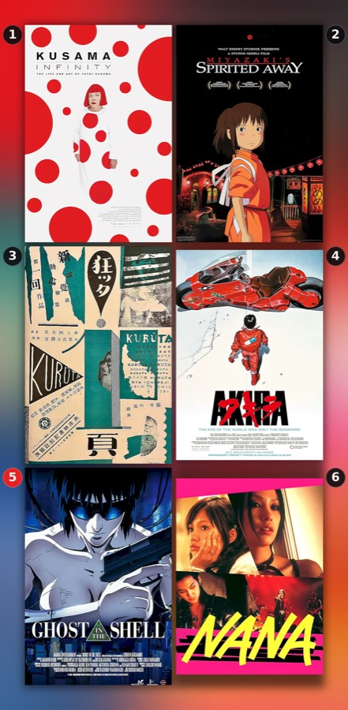
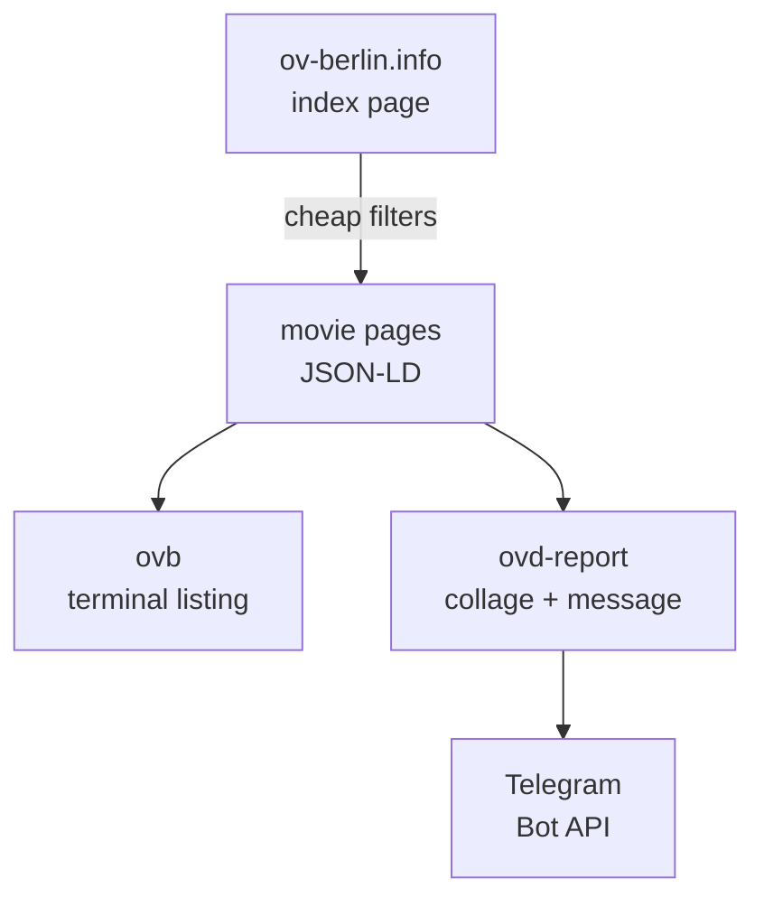

<h1 align="center">ovd-berlin</h1>
<p align="center"><b>Original-language cinema in Berlin: terminal listing and Telegram digest</b></p>
<p align="center">
  
  
  
</p>



Berlin shows hundreds of films a week in their original audio, and
[ov-berlin.info](https://ov-berlin.info) lists them all. What it cannot answer
is *"Japanese, English subtitles, next week"*. These two commands can.

## What it does

- **Filter like a person.** Spoken language, subtitle version, date window,
  cinema, genre, title, IMDb or Letterboxd score, in any combination.
- **Terminal or JSON.** `ovb` prints screenings by day or by film, or dumps
  JSON for `jq`; it is standard library only.
- **Telegram digest.** `ovd-report` posts an album of poster sheets plus one
  message that names every film exactly once, numbered to match.
- **New-film badges.** Films absent from the previous post get a red disc on the
  sheet and a *(New)* tag in the message.
- **Cheap on the site.** Pages are cached for six hours, and only films that pass
  the filters get their page fetched.
- **Venue blacklist.** Cinemas listed in `config/cinema-blacklist.txt` never
  appear in the post, and the run says which entries matched nothing.

<br clear="all">

## Example

```console
$ uv run ovb --lang japanese --days 7
Japanese · English subtitles · 10 Sep – 16 Sep 2026 · 7 movies, 20 screenings

Thu 10 Sep
  20:00  Paprika (2006)
         Babylon Alexanderplatz, Mitte  imdb 7.7  lb 4.1  rt 87%
  21:00  Exit 8 (2025)
         Rollberg Kinos, Neukölln  imdb 6.5  lb 3.1  rt 91%
  …
```

<details>
<summary><b>The Telegram message</b> (rendered; the script emits Telegram HTML)</summary>

```text
🇯🇵 Japanese in Berlin cinemas
11 films · 27 screenings · 11 Sep – 22 Sep

𝟭 · Exit 8
▸ Rollberg Kinos, Neukölln

Babylon Alexanderplatz, Mitte
𝟮 · A Page of Madness
𝟯 · Akira
…
```
</details>

## Quick start

```sh
git clone https://github.com/constkolesnyak/ovd-berlin.git && cd ovd-berlin
uv sync                                  # virtualenv + Pillow
uv run ovb --lang japanese               # Japanese audio, English subtitles

uv run ovd-report                        # dry run: message + collage.png
cp .env.example .env                     # bot token + chat id, chmod 600
uv run ovd-report --send
```

Python 3.10+ on macOS or Linux, with [uv](https://docs.astral.sh/uv/). `ovb` is
standard library only; the report needs Pillow, which `uv sync` installs.

## How it works



The site's RSS feeds carry no language or subtitle information, so both scripts
scrape instead. One request to the `/movies/` index runs every cheap filter; only
the survivors get their page fetched, six at a time. The report then applies the
blacklist and a native-language rule, renders the message, and lays out the posters.

<details>
<summary><b>Under the hood</b></summary>

- **Index cards** carry languages, versions, per-day rows and the ratings as
  `data-*` attributes; movie pages embed JSON-LD `ScreeningEvent` blocks.
- **Cache.** `.cache/` holds pages for six hours (`--ttl`, `--refresh`); a failed
  fetch falls back to a stale copy. The site publishes about 15 days ahead.
- **Native-language rule.** A film counts as Japanese if the language leads its
  list or it comes from Japan; films that merely contain some Japanese dialogue
  are skipped (`--loose` keeps them). Same for Korean and Chinese.
- **Album, then message.** Sheets go out as one media group and the listing as
  its own message: captions are capped at 1024 characters, messages at 4096.
- **Six posters per sheet**, portrait, nothing cropped, every poster at the
  500 px the site serves; the backdrop is each poster's own palette, blurred.
- **New films** are judged against the last delivered post at least three days
  old (`run-history.json`), so a retry never blanks its own badges.
</details>

## Configuration

Only `ovd-report --send` needs credentials, read from the environment or from a
`.env` file in the project root (gitignored; real environment variables win).

| Variable             | Meaning                                      |
| -------------------- | -------------------------------------------- |
| `TELEGRAM_BOT_TOKEN` | Bot token from [@BotFather](https://t.me/BotFather) |
| `TELEGRAM_CHAT_ID`   | Chat or user id to post to, e.g. `123456789` |

`config/cinema-blacklist.txt` holds one venue per line, matched case-insensitively
against the full name (`uv run ovb --list cinemas` prints them; `#` comments).
Every runtime path (`.env`, `config/`, `.cache/`, `run-history.json`, the collage)
resolves from the project root, the parent of the package, so run from a checkout.

## CLI reference

**`ovb`** (exit code `1` when nothing matches)

| Option                          | Meaning                                         |
| ------------------------------- | ----------------------------------------------- |
| `-l`, `--lang NAME`             | spoken language; repeatable, substring match    |
| `-s`, `--subs KIND`             | `omeu` English subs (default), `omu` German, `ov` none, `any` |
| `-d`, `--days N`                | window from `--from`; default: all the site has |
| `--from`, `--to YYYY-MM-DD`     | date window; `--to` overrides `--days`          |
| `-c/--cinema`, `-g/--genre`, `-t/--title` | cinema or district, genre, title; substring |
| `--not-lang NAME`               | drop films that list this language              |
| `--min-imdb X`, `--min-lb X`    | minimum IMDb or Letterboxd score                |
| `--group day\|movie`            | listing layout (default `day`)                  |
| `--sort date\|rating\|title`    | film order for `--group movie`                  |
| `--links`, `--json`             | print ticket links; dump screenings as JSON     |
| `--list langs\|cinemas\|genres` | print the available values and exit             |
| `-r`, `--refresh`, `--ttl SEC`, `--no-color` | bypass the cache; lifetime (21600); plain text |

**`ovd-report`**

| Option                          | Meaning                                         |
| ------------------------------- | ----------------------------------------------- |
| `--send`                        | post to Telegram; otherwise print and write PNG |
| `--lang LANG`                   | language, site spelling (default `Japanese`)    |
| `--from`, `--to YYYY-MM-DD`     | window; defaults tomorrow and open-ended        |
| `--loose`                       | keep films that merely list the language        |
| `--no-blacklist`                | ignore `config/cinema-blacklist.txt`            |
| `--collage PATH`                | output file (default `collage.png`)             |
| `--chunk N`                     | films per sheet (default 6); `0` for one sheet  |
| `--separate`                    | individual photos instead of one album          |
| `-r`, `--refresh`, `--ttl SEC`  | bypass the cache; cache lifetime                |

## Project layout

```text
ovd_berlin/ovb.py             scraper + terminal CLI (standard library only)
ovd_berlin/report.py          Telegram digest: collage, message, delivery
config/cinema-blacklist.txt   venues left out of the report
docs/                         the README image
pyproject.toml                metadata, the two commands, Pillow, ruff settings
.env.example                  TELEGRAM_BOT_TOKEN / TELEGRAM_CHAT_ID template
.cache/  run-history.json  collage*.png   written at run time, gitignored
```

## Development

`uv run python -m compileall -q ovd_berlin` and `uvx ruff check .` (clean);
`python -m ovd_berlin.ovb` also works. There is no test suite: the live site is
the only meaningful test, and a layout change stops both with `parsed 0 movies`.

## License

[MIT](LICENSE). Screening data belongs to ov-berlin.info; posters to their rights holders.
